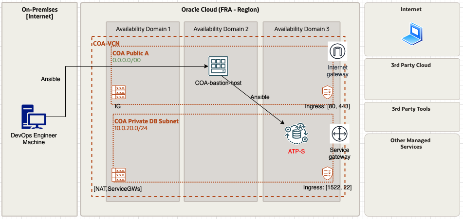

# Using Ansible with GitHub Actions to automate switchover ATP operations

## ✅ Showcase

GitHub Actions is a continuous integration and continuous delivery (CI/CD) platform that allows you to automate your build, test, and deployment pipelines. You can create workflows that build and test every pull request to your repository, or deploy merged pull requests to production.

A workflow is a configurable automated process that will run one or more jobs. Workflows are defined by a YAML file checked in to your repository and will run when triggered by an event in your repository, or they can be triggered manually, or at a defined schedule.

During this UseCase we're going to:

* Use Github Actions to build different workflows.
* Create a test workflow using Lint ansible.
* Run gitops operations in an ATP workload using ansible playbooks.
* We´ll use a host bastion as ansible [control node](https://docs.ansible.com/ansible/2.5/network/getting_started/basic_concepts.html#control-node)




## ✅ Usage

* Clone this repo in GitHub and create you own repository.
* Add the ssh key in the github secrets in order to connect to the bastion :

   * Navigate to your repository and select the Settings tab.
   * Once there you should see on the left a Secrets section third from the bottom of the list, click on that.
   * Click on the New repository secret button. 
   * Add the next secrets:

````
SSH_PRIVATE_KEY
````

* Add also the *VAULT_PASSWORD* as another secret varible in github. Read the readme.md included in ansible/vault to see more information related to encryp files with ansible-vault.

````
VAULT_PASSWORD
````

* The pipelines/workflows configuration are defined in the directory **.github/workflows**, in this case we have created two different workdlows: **LintAnsible.yaml** and **DeployAnsible.yaml**
* Add your bastion ip in the **COA_Ansible_ADB/ansible/hosts** file
* Go to settings of your repo, and active the use of workflows.(*Settings-> Actions-> General-> Allow all actions and reusable workflows*)

## Switchover
If an environment with a local standby and a cross-region standby there will be two different operations.

To swithcover to the local standby:
* Create a new branch.
* Copy the content of the **COA_Ansible_ADB_DG_Switchover/ansible/playbooks/playbook_local_switchover.yaml.yaml** file in **./ansible/playbook.yaml** file 
* Complete the proper value for the variable  **primary_database_id** 
* Commit the changes
* Open a "merge pull request" and check how the first  pipeline run.
* After review the Ansible pipeline (CD) outcome, you can go and confirm the merge. (pull requests-> request)
* When you approve the merge, the "ansible deploy" pipeline will be automatically launch.

To swithcover to the remote standby:
* Create a new branch.
* Copy the content of the **COA_Ansible_ADB_DG_Switchover/ansible/playbooks/playbook_remote_switchover.yaml.yaml** file in **./ansible/playbook.yaml** file 
* Complete the proper value for **primary_database_id** and **cross_region_standby_database_id** variables.
* Commit the changes
* Open a "merge pull request" and check how the first  pipeline run.
* After review the Ansible pipeline (CD) outcome, you can go and confirm the merge. (pull requests-> request)
* When you approve the merge, the "ansible deploy" pipeline will be automatically launch.


* If we review the tab "actions" , we can check our two workflows


## ✅ References
* [Ansible Lint](https://ansible-lint.readthedocs.io/en/latest/)
* [Ansible Linting with GitHub Actions](https://www.ansible.com/blog/ansible-linting-with-github-actions)
* [Run Ansible playbook GitHub Action](https://github.com/dawidd6/action-ansible-playbook)


